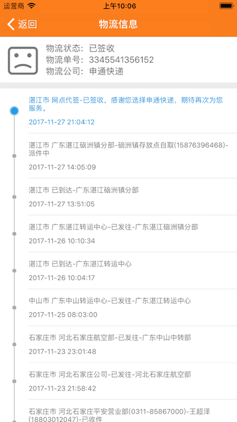

[](https://github.com/90candy/YWLogisticsQuery)
[](https://github.com/90candy)
[](https://github.com/90candy)
[](https://www.jianshu.com/u/0f7d26d766f4)

### 推荐使用`Cocoapod`导入，具体使用请直接查看示例Demo

```
pod 'YWLogisticsQuery', '~> 1.0.0'
```

### ************** 效果图展示 **************


### 这里使用的是快递100

**快递100API帮助文档：https://www.kuaidi100.com/openapi/api_post.shtml**

**所支持的快递公司及参数说明：https://www.kuaidi100.com/download/api_kuaidi100_com(20140729).doc**


查询测试：https://m.kuaidi100.com/query?type=shentong&postid=3345541356152

### JSON格式
```
{
	"message": "ok",
	"nu": "3345541356152",
	"ischeck": "1",
	"condition": "F00",
	"com": "shentong",
	"status": "200",
	"state": "3",
	"data": [{
		"time": "2017-11-27 21:04:12",
		"ftime": "2017-11-27 21:04:12",
		"context": "湛江市 网点代签-已签收，感谢您选择申通快递，期待再次为您服务。",
		"location": ""
	}, {
		"time": "2017-11-27 14:05:09",
		"ftime": "2017-11-27 14:05:09",
		"context": "湛江市 广东湛江硇洲镇分部-硇洲镇存放点自取(15876396468)-派件中",
		"location": ""
	}, {
		"time": "2017-11-27 13:51:05",
		"ftime": "2017-11-27 13:51:05",
		"context": "湛江市 已到达-广东湛江硇洲镇分部",
		"location": ""
	}, {
		"time": "2017-11-26 10:10:34",
		"ftime": "2017-11-26 10:10:34",
		"context": "湛江市 广东湛江转运中心-已发往-广东湛江硇洲镇分部",
		"location": ""
	}, {
		"time": "2017-11-26 10:04:17",
		"ftime": "2017-11-26 10:04:17",
		"context": "湛江市 已到达-广东湛江转运中心",
		"location": ""
	}, {
		"time": "2017-11-25 08:03:00",
		"ftime": "2017-11-25 08:03:00",
		"context": "中山市 广东中山转运中心-已发往-广东湛江转运中心",
		"location": ""
	}, {
		"time": "2017-11-23 23:01:48",
		"ftime": "2017-11-23 23:01:48",
		"context": "石家庄市 河北石家庄航空部-已发往-广东中山中转部",
		"location": ""
	}, {
		"time": "2017-11-23 21:58:42",
		"ftime": "2017-11-23 21:58:42",
		"context": "石家庄市 河北石家庄公司-已发往-河北石家庄航空部",
		"location": ""
	}, {
		"time": "2017-11-23 18:04:23",
		"ftime": "2017-11-23 18:04:23",
		"context": "石家庄市 河北石家庄平安营业部(0311-85867000)-王超泽(18803012047)-已收件",
		"location": ""
	}]
}         
```